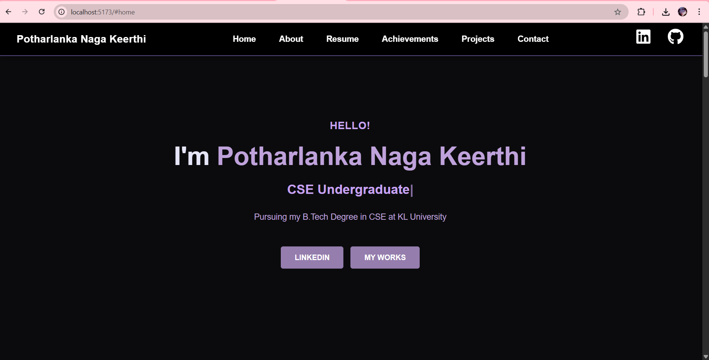

# 💼 Portfolio Website Project

### 🧑‍💻 Developed By:
**Name:** Potharlanka Naga Keerthi  
**University:** K L University, Vijayawada  
**Department:** Computer Science and Engineering (CSE)  
**Year:** B.Tech (2022–2026)  
**Email:** [nagakeerthi9092@gmail.com](mailto:nagakeerthi9092@gmail.com)

---

## 🧾 Aim

To design and develop a **personal portfolio website** that showcases my **skills, education, certifications, achievements, and projects** in an interactive and professional manner using modern web technologies.

---

## 🎯 Objective

- To create an **interactive and responsive** web portfolio that highlights my profile as a Computer Science Engineering student.  
- To demonstrate **frontend development skills** using React and modern UI techniques.  
- To organize and display my **projects, achievements, and resume** in a structured format.  
- To provide visitors and recruiters an easy way to **contact** or **connect** with me through provided links.

---

## 🧠 Software & Technologies Used

| Technology | Purpose |
|-------------|----------|
| **React (Vite)** | Frontend development framework |
| **HTML5** | Structure of web pages |
| **CSS3** | Styling and layout |
| **JavaScript (ES6)** | Interactivity and animation |
| **React Icons** | Icons for LinkedIn, GitHub, and UI elements |
| **VS Code** | Development environment |

---

## 🧩 Project Description

The portfolio website is built as a **single-page application (SPA)** using React. It includes multiple sections:
1. **Home Section** – Introduction and animated typing effect for roles.  
2. **About Section** – Displays personal details, interests, and goals.  
3. **Resume Section** – Highlights education and certifications.  
4. **Achievements Section** – Contains certificates with images.  
5. **Projects Section** – Features my major and minor projects with GitHub links.  
6. **Contact Section** – Includes address, contact number, and a question form link.

The site uses smooth scrolling navigation and a dark-themed design with soft lavender and violet accents for a professional look.

---

## ⚙️ Implementation Steps

1. **Set up the React environment** using Vite.  
2. **Created reusable components** for Navbar, About, Resume, Projects, and Contact sections.  
3. **Added smooth scrolling** for navigation links.  
4. **Designed custom CSS** for responsiveness and animation.  
5. **Integrated social icons** (LinkedIn and GitHub).  
6. **Deployed the project** for public viewing (optional on GitHub Pages or Netlify).

---

## 🧮 Outcome

A fully functional, elegant, and responsive **portfolio website** that:
- Presents my profile in a visually appealing manner.  
- Provides direct access to my **projects, resume, and certifications**.  
- Acts as a **professional personal webpage** for academic and placement purposes.

---

## 🏁 Result

The **Portfolio Website Project** was successfully designed and implemented using **React and CSS**.  
It effectively showcases my **technical skills, achievements, and projects**, helping to build a strong personal brand and professional presence online.

---

## 📸 Screenshot (Optional)

---

## 🌟 Developed By

**👩‍💻 Potharlanka Naga Keerthi**  
Department of Computer Science and Engineering  
K L University, Vijayawada  

📧 [nagakeerthi9092@gmail.com](mailto:nagakeerthi9092@gmail.com)  
🔗 [LinkedIn](https://linkedin.com/in/potharlanka-naga-keerthi-b6b209257) | 
[GitHub](https://github.com/Keerthi9092)
